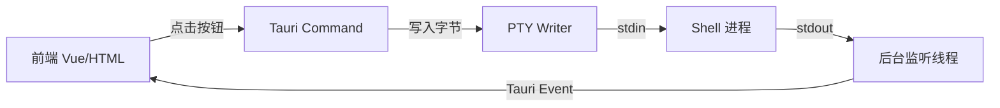

### 一、技术选型

**问题分析**
核心验证点：Tauri 2.0 是否能稳定作为“中间人”，将前端的抽象事件（点击按钮）转化为底层 Shell 能够识别的字节流（包括 ASCII 控制字符）。这涉及 Tauri 的 IPC 通信效率、Rust 对系统调用的封装能力以及 PTY 的标准输入捕获。

**最终选择 + 理由**
**Tauri 2.0 (Beta) + portable-pty + xterm.js**

* **Tauri 2.0**：IPC 机制重构，通信延迟更低，适合高频终端交互。
* **portable-pty**：Rust 生态中唯一成熟跨平台 PTY 库，能直接写入字节流（`\x03` 等），是验证“虚拟化按键”的关键。

---

### 二、整体架构

极简 MVP 架构，去除所有网络层，专注验证 **“UI 事件 -> Rust -> PTY 进程”** 这一路径。



---

### 三、核心代码片段

#### [模块A: 后端核心]

**关键点**：

1. 使用 `Mutex` 保护 `PtyWriter` 以支持多线程写入（响应前端点击）。
2. 将前端传来的字符串直接写入 PTY，**不做转义**，从而验证 `\x03` (Ctrl+C) 等控制字符是否能生效。

```rust
// src-tauri/src/lib.rs
use portable_pty::{native_pty_system, CommandBuilder, PtySize};
use tauri::Manager; // 用于获取 window 发送 event
use std::sync::{Arc, Mutex};
use std::io::Write;

// 定义一个全局状态，存储 PTY 的写入句柄
struct PtyState {
    writer: Arc<Mutex<Box<dyn Write + Send>>>,
}

#[tauri::command]
fn init_pty(window: tauri::Window) -> Result<String, String> {
    // 1. 初始化 PTY 系统
    let pty_system = native_pty_system();
  
    // 2. 打开一个 PTY 对，设定初始大小
    let pair = pty_system
        .openpty(PtySize {
            rows: 24,
            cols: 80,
            pixel_width: 0,
            pixel_height: 0,
        })
        .map_err(|e| e.to_string())?;

    // 3. 启动 Shell (默认使用系统 shell)
    let mut cmd = CommandBuilder::new_default_prog();
    let _child = pair.slave.spawn_command(cmd).map_err(|e| e.to_string())?;

    // 4. 获取写入句柄，并用 Arc<Mutex> 包裹供后续使用
    let writer = pair.master.take_writer();
    let writer_state = Arc::new(Mutex::new(writer));

    // 5. 启动读取线程，持续读取 Shell 输出并推送到前端
    let mut reader = pair.master.try_clone_reader().map_err(|e| e.to_string())?;
  
    // 将 writer_state 存入 Tauri State，供 write_to_pty 使用
    // 注意：Tauri 2.0 的 manage 机制
    window.app_handle().manage(PtyState { writer: writer_state.clone() });

    std::thread::spawn(move || {
        let mut buf = [0u8; 1024];
        loop {
            match reader.read(&mut buf) {
                Ok(n) if n > 0 => {
                    let data = String::from_utf8_lossy(&buf[..n]).to_string();
                    // 发送事件到前端
                    let _ = window.emit("pty-data", data);
                }
                _ => break, // EOF or Error
            }
        }
    });

    Ok("PTY Initialized".into())
}

#[tauri::command]
fn write_to_pty(state: tauri::State<'_, PtyState>, input: String) -> Result<(), String> {
    // 核心：直接写入字符串。前端传入 "\x03" 或 "r"，这里都会转为字节发给 Shell
    let mut writer = state.writer.lock().unwrap();
    writer.write_all(input.as_bytes()).map_err(|e| e.to_string())?;
    writer.flush().map_err(|e| e.to_string())?;
    Ok(())
}

// Tauri 2.0 入口
#[cfg_attr(mobile, tauri::mobile_entry_point)]
pub fn run() {
    tauri::Builder::default()
        .invoke_handler(tauri::generate_handler![init_pty, write_to_pty])
        .run(tauri::generate_context!())
        .expect("error while running tauri application");
}
```

**设计理由**：
通过 `String` 传输而非枚举，是为了最大化验证灵活性。如果前端发 `"\x03"` Rust 端能原样写入，即证明 Tauri 完全具备虚拟化按键能力。

#### [模块B: 前端交互界面 (Vue 3)]

**关键点**：
构建一组“虚拟按键”，映射到控制字符和普通字符。验证用户点击“Ctrl+C”按钮时，终端内的进程是否真的收到中断信号。

```vue
<!-- src/App.vue -->
<script setup>
import { onMounted, ref } from 'vue';
import { Terminal } from 'xterm';
import { invoke } from '@tauri-apps/api/core';
import { listen } from '@tauri-apps/api/event';

const terminalContainer = ref(null);
let term = null;

onMounted(async () => {
  term = new Terminal({ cursorBlink: true });
  term.open(terminalContainer.value);
  
  // 1. 初始化后端 PTY
  await invoke('init_pty');

  // 2. 监听后端数据输出
  await listen('pty-data', (event) => {
    term.write(event.payload);
  });

  // 3. 允许用户在终端直接输入
  term.onData(data => {
    invoke('write_to_pty', { input: data });
  });
});

// 核心：虚拟按键事件映射
const handleAction = async (type) => {
  let payload = "";
  switch(type) {
    case 'r': payload = 'r'; break;           // Flutter 热重载
    case 'enter': payload = '\r'; break;      // 回车
    case 'ctrl_c': payload = '\x03'; break;   // 中断信号
    case 'ctrl_z': payload = '\x1a'; break;   // 挂起信号
    case 'ls': payload = 'ls -la\r'; break;   // 复合命令
  }
  await invoke('write_to_pty', { input: payload });
};
</script>

<template>
  <div class="container">
    <!-- 虚拟控制面板 -->
    <div class="control-panel">
      <button @click="handleAction('r')">输入 'r' (热重载)</button>
      <button @click="handleAction('enter')">Enter</button>
      <button @click="handleAction('ctrl_c')" class="danger">Ctrl + C (中断)</button>
      <button @click="handleAction('ctrl_z')">Ctrl + Z</button>
      <button @click="handleAction('ls')">执行 ls -la</button>
    </div>
  
    <!-- 终端显示区 -->
    <div ref="terminalContainer" class="terminal"></div>
  </div>
</template>

<style>
.container { display: flex; flex-direction: column; height: 100vh; }
.control-panel { padding: 10px; background: #f0f0f0; display: flex; gap: 10px; }
.terminal { flex: 1; }
button { padding: 8px 16px; cursor: pointer; }
button.danger { background: #ff4d4d; color: white; }
</style>
```

**设计理由**：

* **暴力验证**：直接硬编码 `\x03`，如果点击按钮终端里的 `ping` 或 `npm start` 停止了，证明方案可行。
* **复合指令**：`ls -la` 的测试证明不仅支持单字符，还支持脚本化的命令注入。

---

### 四、技术路线图

```
阶段1: 边界验证 (当前)
[集成 portable-pty] → [实现按钮 -> 字节流映射] → [验证 Ctrl+C/特殊字符是否生效]

阶段2: 封装与扩展
[封装虚拟键盘组件] → [支持组合键 (如 Ctrl+A, D)] -> [集成 MCP 接口]

阶段3: 稳定性
[处理 PTY resize] → [异常退出重连机制]
```

### 五、工具链清单

| 阶段               | 工具                   | 版本                | 用途                            |
| :----------------- | :--------------------- | :------------------ | :------------------------------ |
| **验证核心** | **Tauri**        | 2.0.0-beta          | 提供 IPC 通道，连接 UI 与系统层 |
|                    | **portable-pty** | 0.8.0               | 模拟终端环境，接收虚拟按键输入  |
|                    | **xterm.js**     | 5.3.0               | 前端渲染层，仅作为视觉反馈      |
| **辅助**     | **Tauri APIs**   | @tauri-apps/api 2.0 | invoke (调用) / listen (监听)   |
